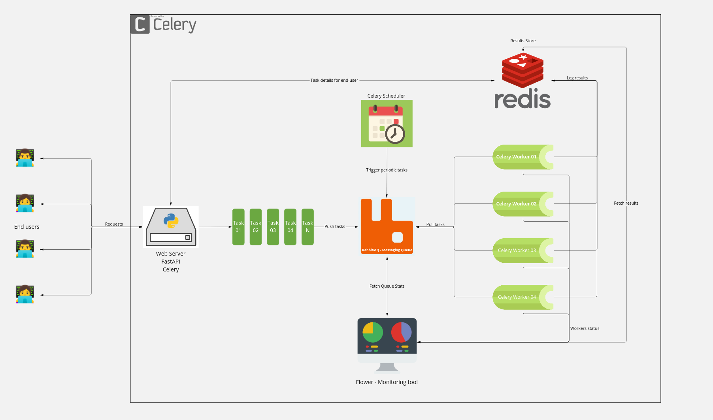

# Async docker rest application
A rest service that accepts the Dockerfile as input, builds the image, and pushes it to the container registry.

## Getting Started
The solution is containerized and to get started you need to have:
- Docker
- Docker compose

Use the following docker-compose command to get started

```sh
$ docker compose up -d
```

Six containers will start at following port:
- `web-server`: `8080` - Web server container 
- `Redis`: `6379` - Redis container
- `RabbitMQ`: `5672 & 15672` - RabbitMQ container
- `Worker 1`: `No Mapping` - Celery worker 01 container
- `Worker 2`: `No Mapping` - Celery worker 02 container
- `Scheduler`: `No Mapping` - Celery scheduler container
- `Dashboard`: `5555` - Dashboard container for monitoring the tasks

The solution provides the following API endpoints:
- `/api/v2/docker/build/{image_name}/{version}?push=True`: The endpoint for creating build and pushing the image to the container registry
- `/api/v2/docker/task/{task_id}`: The endpoint for getting the status of a task

For detail information about the API endpoints see the [OpenAPI documentation](http://localhost:8080/docs#/)

**Sample Requests:**

Request new build:

```sh
curl --location --request POST 'http://0.0.0.0:8080/api/v2/docker/build/test_image/0.0.1' \
--header 'Content-Type: text/plain' \
--data-raw 'From alpine:latest
RUN apk add --no-cache curl'
```

Request status of a task:

```sh
curl --location --request GET 'http://0.0.0.0:8080/api/v2/docker/build/task/{TASK_UUID}'
```

## Architecture

